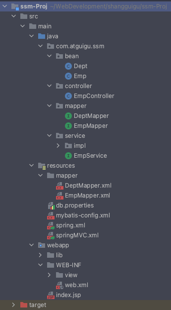
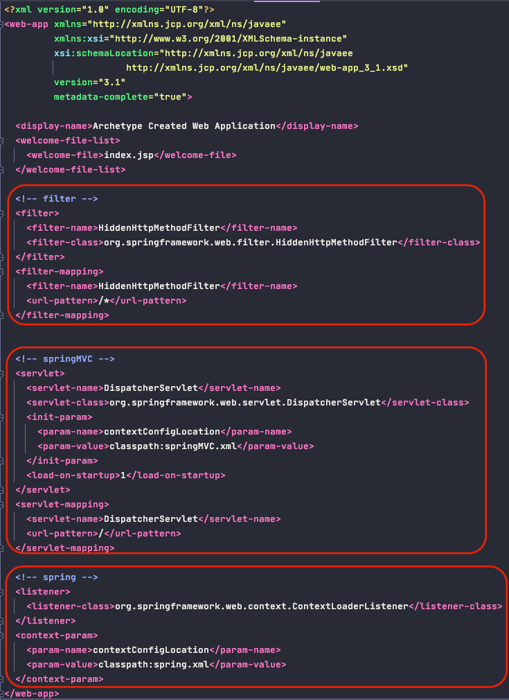
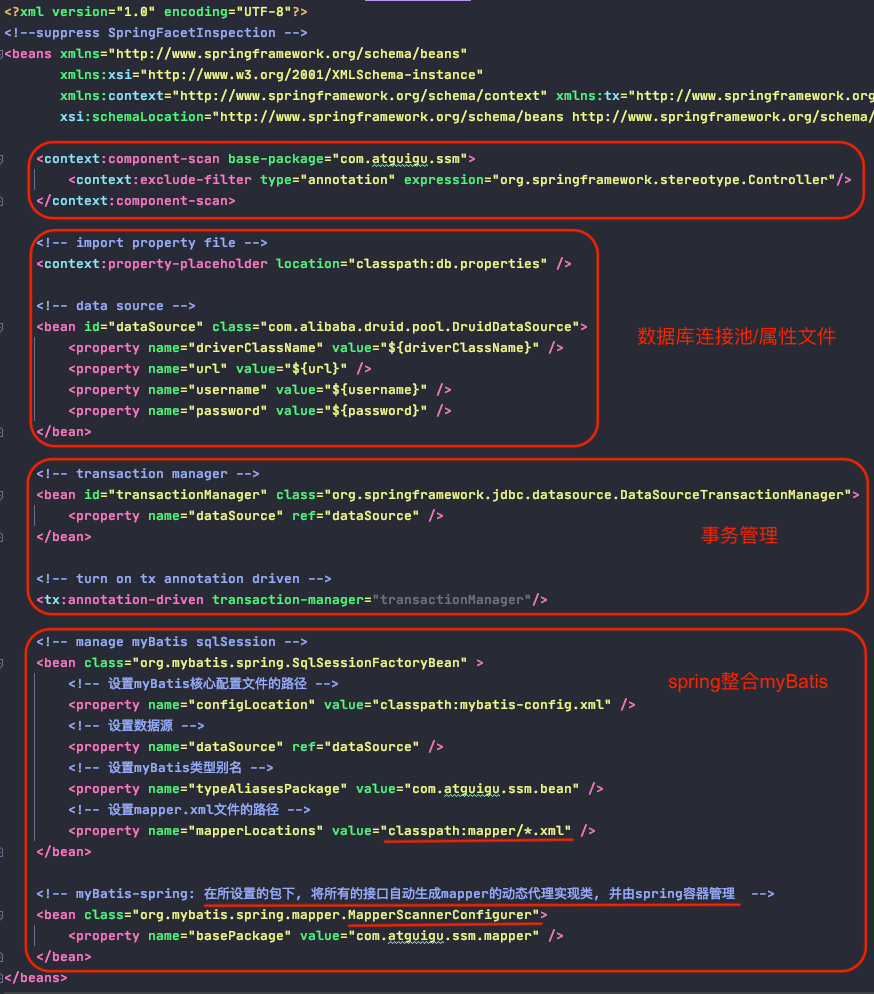
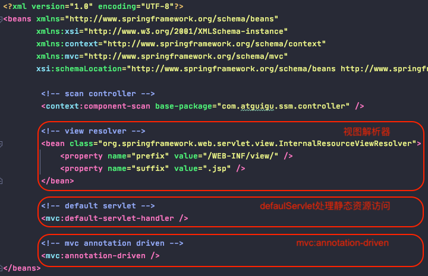
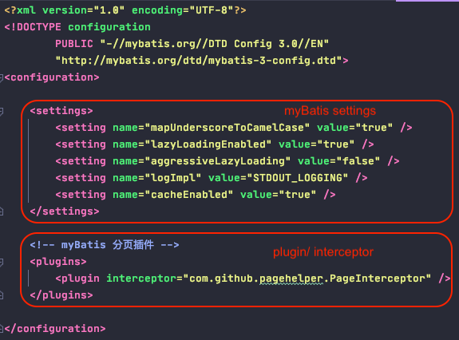
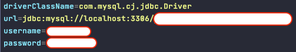

# SSM

0. SSM
    
        = Spring + SpringMVC + MyBatis
        
        
1. Jar包

        spring-core(IOC):
            spring-beans.jar
            spring-core.jar
            spring-context.jar
            spring-expression.jar
        
        
        springMVC/web:
            spring-web.jar
            spring-webmvc.jar
            javax.servlet-api.jar     (原生servlet-api)
            taglib-standard-impl.jar  (el/jstl)
            taglib-standard-spec.jar  (el/jstl)
            jackson-annotations.jar   (json)
            jackson-core.jar          (json)
            jackson-databind.jar      (json)
            
        
        jdbc:
            spring-jdbc.jar
            spring-orm.jar
            spring-tx.jar
        

        spring-aop(AOP):
            spring-aop.jar
            spring-aspects.jar
            com.springsource.net.sf.cglib.jar
            com.springsource.org.aopalliance.jar
            com.springsource.org.aspectj.jar
            
            
        myBatis:
            myBatis.jar
            myBatis-spring.jar (myBatis与spring整合的适配包, 用于让spring容器来管理/装配动态代理生成的mapper代理类对象)
            pagehelper.jar
            jsqlparser.jar
        
        
        database/connection pool:
            mysql-connector.jar
            druid.jar
        
        
        logging:
            commons-logging.jar

2. 配置文件
        
        文件目录

    
        - web.xml
        
        
        - spring.xml
        
        
        - springMVC.xml

        
        - myBatis-config.xml

        
        - db.properties

